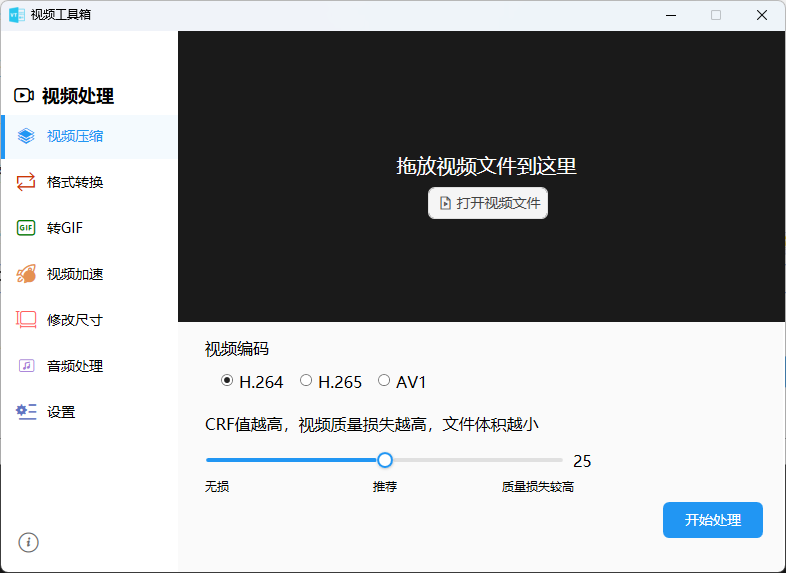
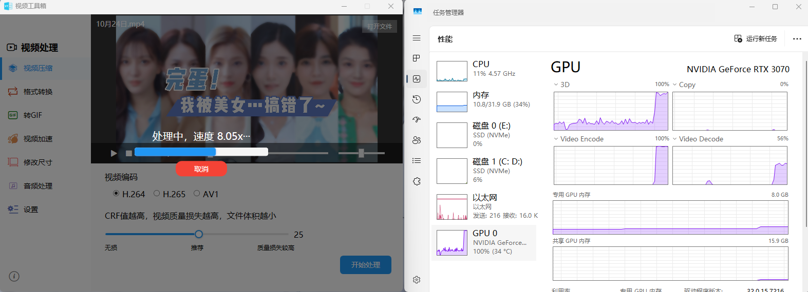
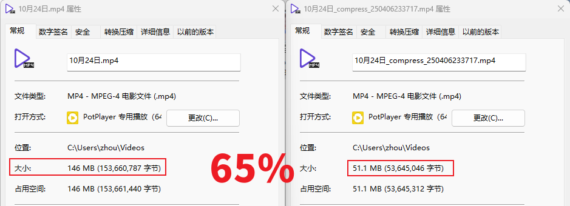
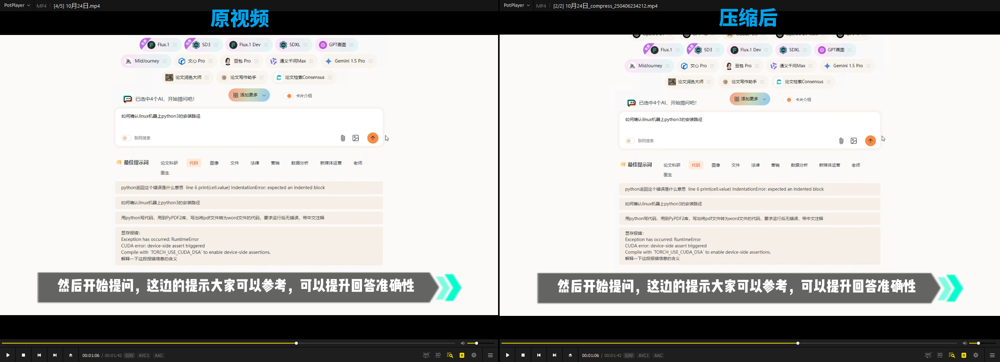

# VidelTools

## 简介

VidelTools是一个用于视频处理的工具集。  
目的是实现一个小而美的视频处理工具，最常用的就是压缩以及转GIF~  
软件体积仅200k大小，无需安装，开箱即用。软件虽小，“五脏俱全”！
> 本工具依赖于ffmpeg提供的强大的视频处理能力。ffmpeg可以在软件内部直接在线下载，也可以用户自行下载选择程序路径。  

## 使用

软件首次启动会提示用户选择ffmpeg的路径。用户可以自行下载ffmpeg，也可以在线下载。

## 功能

- 视频压缩
- 格式转换
- 转GIF
- 视频加速
- 修改尺寸
- 音频处理

## GPU加速支持情况

支持Intel/AMD/Nvidia GPU加速。

## 测试

### 测试环境

- 测试环境：Windows 11
- 测试设备：Intel i7-10700KF+RTX3070
- 测试视频：2560x1440 2K

### 测试结果

- 测试结果：体积减小65%
- 耗时：≈13s

## 编译环境

- Visual Studio 2022
- .Net 4.8

## 配置文件

用户配置文件存储在用户目录下的`AppData\Roaming\.VideoTools_250405`文件夹内
